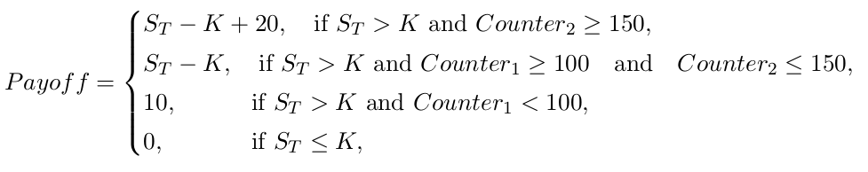
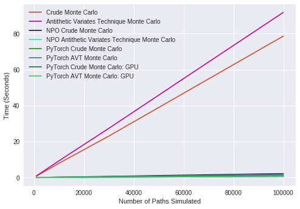
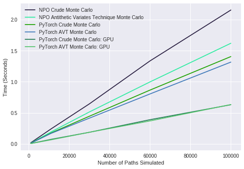

# barrier-option-pricer
Path-dependent barrier option pricing application, scaled down to work on Heroku free tier.
Try it out [here](https://barrier-option-pricer.herokuapp.com/)

## What is a barrier option?
Barrier options are derivatives of an asset where payment depends on the price of the asset breaching a certain barrier price.

## What type of barrier option is this tool useful for?
This particular tool focuses on pricing an exotic barrier option where we cannot feasibly utilise analytical methods such as partial differential equations as the price conditions are too complicated.

* The exotic barrier option is path-dependent such that payoff depends on the number of days where the price of the option exceeds the barrier. There are two such barriers, `First Barrier Level` and `Second Barrier Level`, with day counts `Counter1` and `Counter2` respectively.
* Payoff resembles a Call Option, however it is more complex. Let `S<sub>t</sub>` be the share price at time `t` and `K` be the strike price. 
* The cut-off points `100` and `150` days used for payoff can both be configured in the app with `Counter 1 Level` and `Counter 2 Level` (it was not necessary for these to be variables in the project description)

Payoff is as follows:


## Setup:
Creating a new virtual environement is recommended.

```
conda create -n object_detection python=3.7
conda activate object_detection
```

Git clone the repo and change directory into it. Then pip install the packages in `requirement.txt`.
```
cd directory/you/want/to/clone/into
git clone https://github.com/mdunlop2/barrier-option-pricer.git
cd barrier-option-pricer
pip install -r requirement.txt
```
Now test the application:
```
python app.py
```
Open a web browser and enter: `0.0.0.0:8050/`

## Pricing Methods
There are two pricing methods implemented in the application, stored in `pricing_functions.py` :
### Crude Monte Carlo:
Crude Monte Carlo is the simplest implementation, simply creating a matrix of random normal variables called
rand to represent the share price change over each time step. This way, the price of the share at each time step is
stored in `S_val` and the number of times it crosses each barrier can be recorded, `counter1` and `counter2`.

The payoff for the option is then calculated using the number of times the share passed each barrier and the share
payoff at maturity, using `master_pricing_function.py` . This is discounted to present value at risk
free rate `r` and the estimated price is the mean of this array’s first column. Standard deviation of the price
and counters are also returned to the user.

### Antithetic Variates Technique Monte Carlo: (AVT)
AVT differs from Crude Monte Carlo in that for each random normal variate in the matrix, its negative counterpart is
also included, halving standard deviation of generated prices and compute time. This gives a more realistic approximation of the riskiness of the asset.

## GPU implementation
Try out our notebook CUDA_pricer_demo.ipynb to utilise PyTorch and Nvidia CUDA for over 126x speed improvement. The notebook is designed to be run in Google Collab, which offers a GPU for free (for 12 hours).

## Performance
Monte-Carlo simulation is square root convergent. Therefore a 100x increase in speed (ie. simulations per second) will result in an answer which is 10x more accurate. We saw a massive increase in computational speed using GPU and optimised Matrix Multiplication Libraries (NumPy Optimized) which translates to more accurate prices for the same amount of time.

GPU Used: Nvidia K80

CPU Used: Intel Xeon 2.3 Ghz (2 threads)





We see some improvement by using the GPU however we should also note that PyTorch can be used for matrix multiplication on multiple threads of a CPU and hence we should also test a multicore CPU similar in price to an Nvidia K80 for a fair comaprison as the Google Collab Machine was supplied with 1 core (two threads).

What is interesting is the performance of the GPU is not perfectly linear, as the matrix sizes increase, the time taken per simulation actually drops (as opposed to increasing linearly with other methods). This result shows that GPU is more efficient with larger matrices.

There is plenty of room for optimisation here, especially since the final, discounted prices are always computed using CPU due to the complex payoff function.
